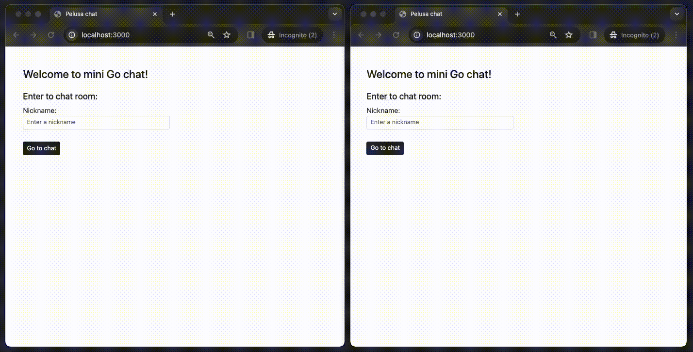

# Welcome to this mini chat room project!

Hi, this project is used in this [Medium post](https://medium.com/@jean.leon.v/mini-chat-room-using-go-fiber-341bc1848f0d) to showcase the use of goroutines, channels, WebSockets, and how to apply them for basic chat interaction.

Feel free to contribute and improve the code! :)

## Run:
```
go run cmd/main.go
```

## Demo:
